# Hide Cobalt-Strike like a PRO

Bypass Kaspersky End Point Security AV/EDR

<h2 align="center"></h2>

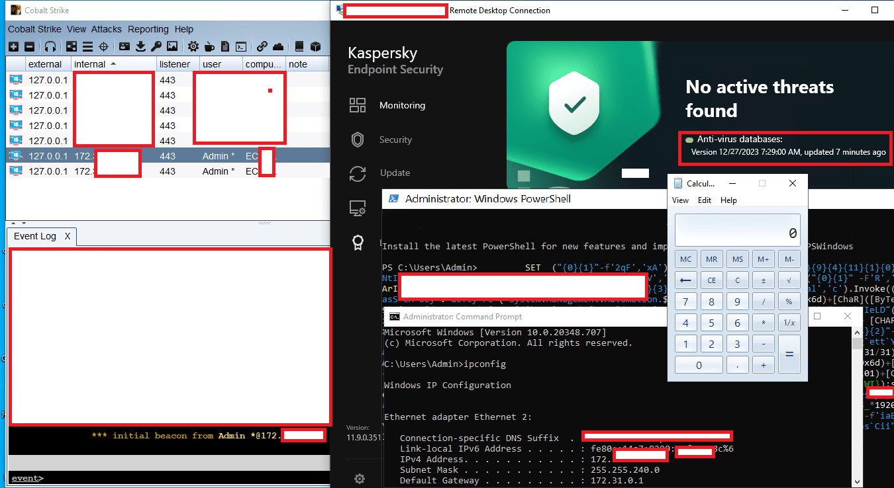

<p align="center">


~/ Clone *.Kaspersky.com SSL & Avoid BlueTeam

~/ Bypass Kaspersky AV / EDR 12.27.2023

Before i start, this topic will include everything to hide your teamserver! when i say everything i mean all of these shitty will be undetectable and never be hunted !

Since November 2021 Shodan has registered “Cobal Strike Beacon” as a product in its dashboard, and ofcourse the rest will be added already, many scanners and blueteams now are working on scanning cobaltstrike from outside the box... what i mean in this is that once you install your VPS and make some OPSEC security on it like:

* SSH tunneling, block, etc.
* Apache/nginx tunnel and security.
* Cloudfront or CloudDFlare setup without some advanced OPSEC.
* Changing teamserver default port.
* Changing SSL default CERT.

and much more things you still need to change and implement in your infrastructure to make sure all these guys who's launching them honeypot or blueteam who looking forward you.

In this topic i will talk about 2 parts, first part we will hack cobaltstrike code, as promised for last release of cobaltstrike 4.9 where many guys want to know how to compile or how to y modify cobaltstrike with them self.. and the second part will be to present my new script tool HCS ( Hide Cobalt Strike ), the most advantage of using HCS tool is to obfuscate online scanners, and honeypot, your datacenter.. because they all depend on JARM signatures ( aka JA3 + JA3's ), and i did scanned almost 10GB of JARM signatures and this will be used only frequency in the JARM hash's, so once you choice install JARM, you don't need to cover all configuration and compilcated things.. plus you dont need to put only one JARM in your teamserver, NO! the tool will keep updating your teamserver JARM every 5 seconds for almost 1GB of JARM signatures, so it will be almost impossible to these scanners to hunted you.

I will add more features in future to stop all kind of detect and distrubtion services who trying to hunting teamservers, so you don't need to be good OPSEC or bad, or junior, my tips.. and tricks, and my updated versions of this tool will give you the latest "START BEFORE YOU READY!" security and safty...

This tool will give you super power and safe your time for looking here and there to know how to work in peace mind, and to get your beacons undetectable as long as you keep updating yourself with latest update of this tool !

The waiting undetectable cobaltstrike 4.9 + 4.9.1 JAR files will be included in this tool, also will include some other versions of cobaltstrike which work in Linux, MacOS, and windows using CrossC2 Plugin.

As i see and I want mention here one thing, the leaked cobaltstrike 4.9 it's not in "working state" for most of the guys who have the leaked one... there is a beacon exit issue when you elevate your privileges..

<h2 align="center"></h2>

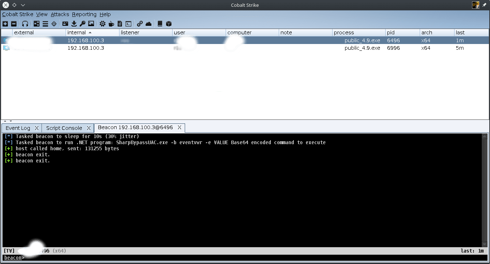


In my release of cobaltstrike 4.9 in HCS script the beacon exit is fixed and no longer exit... VNC working fine, and much more!

Files of cobaltstrike.jar + cobaltstrike-client.jar ┐(ﾟ～ﾟ )┌

I want to mention about the new release of cobaltstrike 4.9 hearts‿hearts which cover some new update especailly againts cracking with JAR file, we will talk about this in seperate topic later on, since there is no much different between the cobaltstrike version 4.9 and 4.9.1 expect few things i have bypass it with HCS script !

<h2 align="center"></h2>

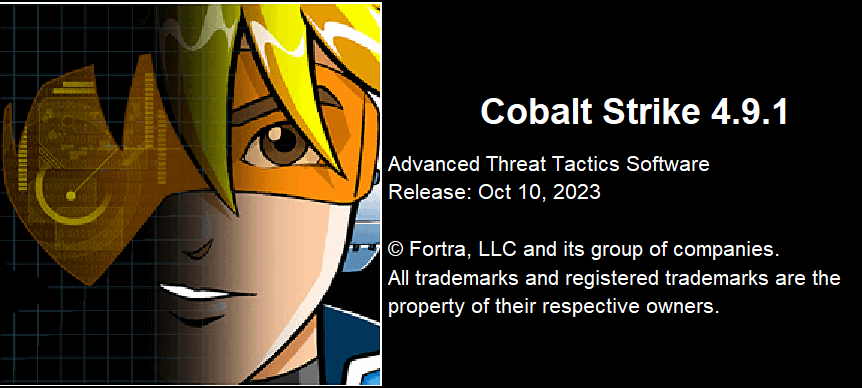

<p align="center">


We will talk now in this topic on how to modify checksum8 for begginners, and modify cobaltstrike URI features manually to have your stagers untracbles and clean from default URI

Now the series time !

Now Let's start toNow Let's start to Download Original CobaltStrike 4.9 + 4.9.1

I want to mention to who are using JAVA 1.8, and other version, to upgrade the JAVA to latest version, since the stable version of my working cobaltstrike is JAVA 18, i did use JAVA 17 and will JAVA 18 will be working fine with no issue for you.

```
sudo apt update
apt-get install openjdk-18-jdk -y
```

Check your version by running "java -version".

Second my recommended & preffered java editor and compiler is LUYTEN Java Decompiler GUI ¯\_(ヅ)_/¯" and for juniors i recommend Intellij IDEA... i will go through both in anyway.

* Luyten.
* IntelliJ Idea.
* Java JDK.

The java-compiler is needed also with Idea, i will explain to you how to download it through plugins.

### Luyten

To start with luyten, just put the cobaltstrike.jar with luyten.jar in same folder as below picture, and run the command:

```
java -jar luyten.jar cobaltstrike.jar
```

<h2 align="center"></h2>

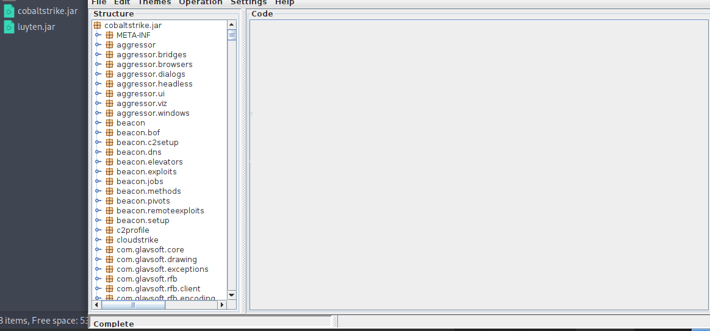

<p align="center">


Then select :

```
file --> save all --> decompiled-cobaltstrike.zip
```

Once decompiled copy is ready you will see ( completed ) in the bar down like this.

Now your ready to start modify cobaltstrike JAVA files with any kind of editor you like, but we will skip this since i don't want make more longer topic for advanced use.

Let's go with IDEA..

### Activate Intellij IDEA

Once you download the IDEA, you may need to activate it for free ;) if so, then go to // Activate Intellij Idea "Latest version".

First you need to download latest version from official site here, and choice your destro... once finish the installation, go to help --> register as below picture.

<h2 align="center"></h2>

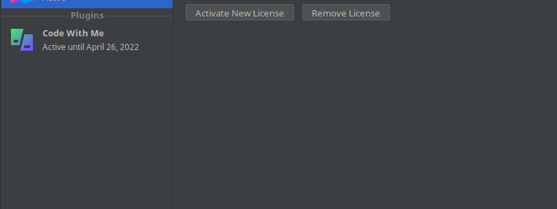

<p align="center">


Then click on "Activate new License", choise any of the free activation servers below:

```
http://lic-server.mephi.ru
https://jetbrains-license.learning.casareal.co.jp
http://adsk06.tpu.ru:8080
```

Congratulations, now we can work on IDEA without 30 days issue...

Next step go to

```
File --> setting --> plugins --> click on ( Marketplace ).
```

Here you need to write ( java decompiler ) to install the decompiler tools, and IDEA classes.

<h2 align="center"></h2>

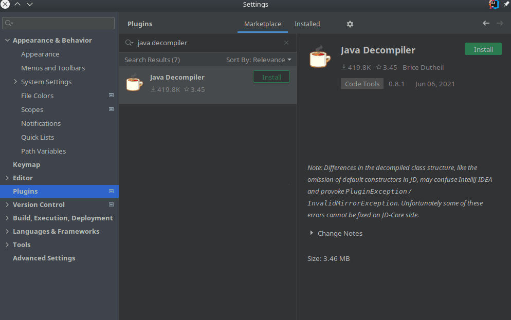

<p align="center">


Now don't forget after choising "JAVA Decompiler" to click on apply and then OK.

Ok... now the work demo will be in windows since it's more stable than linux, but ofcourse you can work in linux (parrot, kali) if you prefer.

Were done to prepare our self for start... let's specify our "JAVA DECOMPILER" plugin we just install in our CMD.

### Intellij IDEA setup

You neet to mention here 3 important notes:

1) We need to add the arguments of IDEA decompile:

```
org.jetbrains.java.decompiler.main.decompiler.ConsoleDecompiler -dsg=true
```

2) We need to put the location of IDEA java-decompiler which we install from plugin.

```
D:\IntelliJ.IDEA.2022.1.1\plugins\java-decompiler\lib\java-decompiler.jar
```

3) The original cobaltstrike.jar inside decompile location of IDEA project, which we will decompile it and put the CS 4.9 .JAVA files inside (decompiler_cobaltstrike) folder.

D:\CS\CS_4.9\decompiler_cobaltstrike

The complete command should be looks like this:

```
java -cp D:\IntelliJ.IDEA.2022.1.1\plugins\java-decompiler\lib\java-decompiler.jar org.jetbrains.java.decompiler.main.decompiler.ConsoleDecompiler -dsg=true D:\CS\CS_4.9\cobaltstrike.jar D:\CS\CS_4.9\decompiler_cobaltstrike\
```

Now once we start decompile...the last decompiled class is: ZoomableImage, check below picture:

Now we need to create 2 folders inside our IDEA project:

Now we need to create 2 folders inside our IDEA project:

1) src: we will have our modified java files..
2) lib: we will have our decompiled cobaltstrike files.
3) output: this is where we will get the compiled jar file.

Then we need to extract the (decompiled_cobaltstrike.jar) we have inside (decompiler_cobaltstrike) folder as below:

after done theouside files, open the IDEA, it's should look like this:

<h2 align="center"></h2>

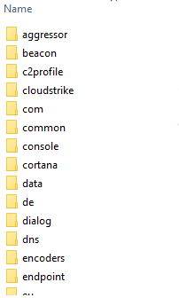

<p align="center">


You may have warning message to trust the project, and since we are using original cobaltstrike.jar you may trust it, otherwise just watch ┐(ﾟ～ﾟ )┌

<h2 align="center"></h2>

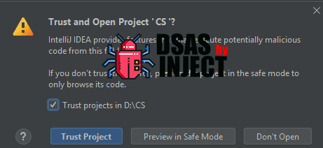

<p align="center">


The final structure inside IDEA project should looks like this, where the original cobaltstrike.jar will be inside the lib folder, we need it to be there for the compiled success.. and the decompiler_cobaltstrike files will needed for modified the files... and the SRC folder we will put what files we need to modified in the cobaltstrike.jar

Now we need to check the SDK and JAVA compiler as set correctly before we start modified..

Go to ( File --> Project Structure --> check SDK version is set to 18 ) as picture below:

<h2 align="center"></h2>

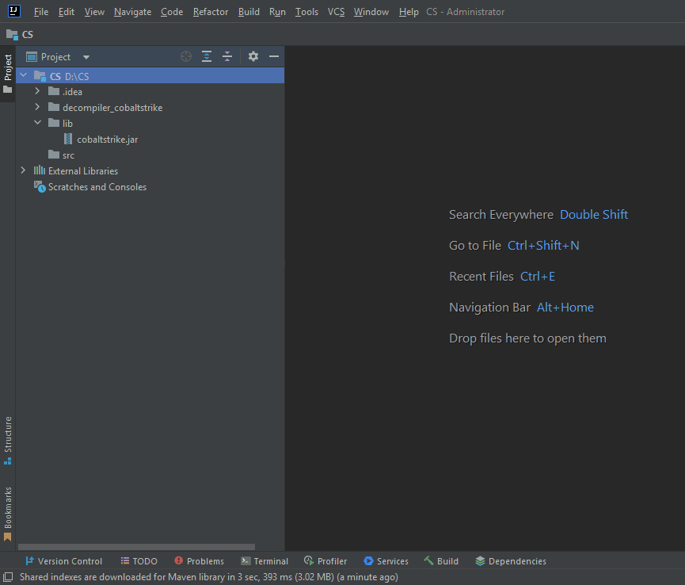

<p align="center">


Check everything is set as the picture below:

<h2 align="center"></h2>

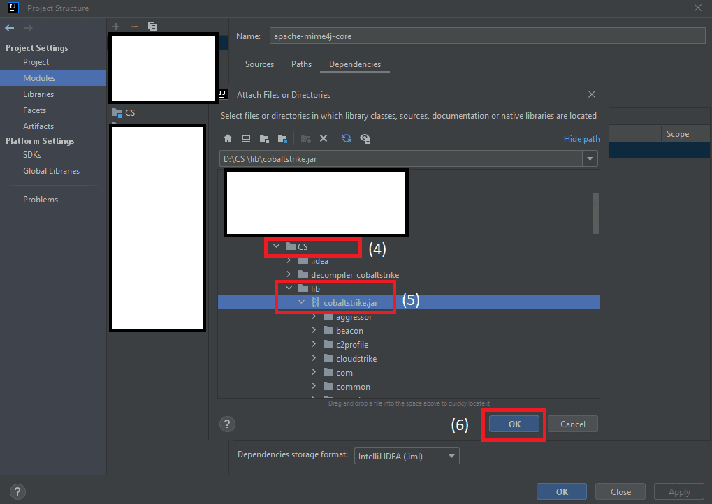

<p align="center">


Then click on "Apply" and then "OK".

Click now on the "check icon" as picture below, then "APPLY" and the we will go then to click on "Artifact".

Then select the "Aggressor" and then "OK".

<h2 align="center"></h2>

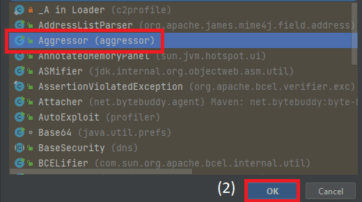

<p align="center">


The looks should be like this ( make sure Module location is set to your project address ) and the click "OK".

<h2 align="center"></h2>

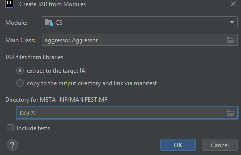

<p align="center">


Now last check to check the SDK folder of your JAVA 18 is set correcting inside JDK home path.

I have extract the JAVA 18 files inside my D:/JAVA folder, so this is expection, you may have it in C:\Java18 or any other place you have installed the JAVA files inside.

Now our structure IDEA for compiling, and modife are ready to start.. so everything from now is easy to understand and you can put your imaging to didn't follow me, you can change your data as per your need... if you looking to make your own modified cobaltstrike 4.9 or 4.9.1 cobaltstrike!

### Modify checksum8

The files which containe the algorithm checksum8 of cobaltstrike webserver is (2) files.

1) "WebServer.java" file in "decompiler_cobaltstrike\cloudstrike".
2) "CommonUtils.java" file in "decompiler_cobaltstrike\common".

We need to copy these 2 files inside our "SRC" folder, with same folder structor name where this is a "MUST", check below screenshot.

Now click on the Webserver.JAVA file and "ctrl+f" to search for "checksum8" word.

The above selected is the important part of checksum8, we have 3 steps to do here:

1) delete or keep the (% 256L) value, since we going to change our stagers hashsum this wont effect us anymore.
2) change the x32 and x64 hashsume address to another extention, example... you can make your beacon uri hashsum on base of images .JPG, or base of .PNG, or base of .JS, or .PDF, any kind of extention with this script, i will use .PDF extention for thie demo.
3) after changing the hashsum we need to modify the result in WebServer.JAVA

```
public class EchoTest {
    publicstatic long checksum8(String text) {
        if (text.length() < 4) {
            return0L;
        }
        text = text.replace("/", "");
        long sum = 0L;
        for (int x = 0; x < text.length(); x++) {
            sum += text.charAt(x);
        }
        return sum;
    }
    publicstatic void main(String[] args) throws Exception {
        System.out.println(checksum8("1.pdf"));
    }
}
```

Here i did mention the address to: 1.PDF for our x32 which give us 2665 where in cobaltstrike default was 92 !

You can change your address you want, it's for your imagain now ;)

<h2 align="center"></h2>

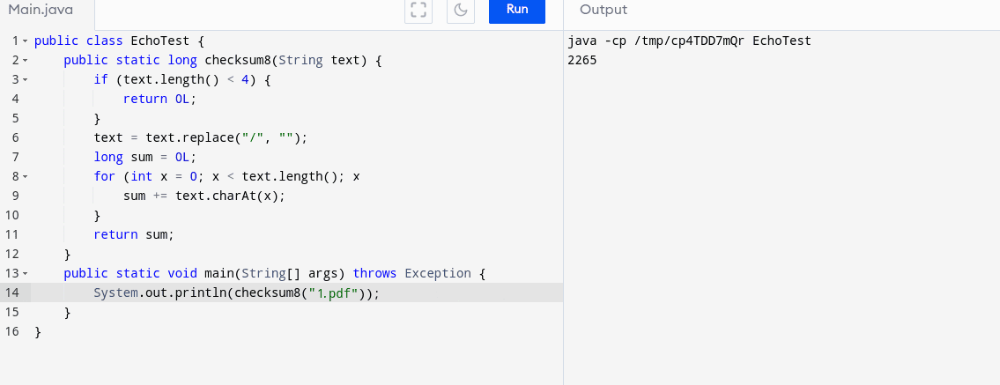

<p align="center">


The second x64 stage address is: 1.PDF which igive us 2664 and in the default cobaltstrike was 93 !

<h2 align="center"></h2>

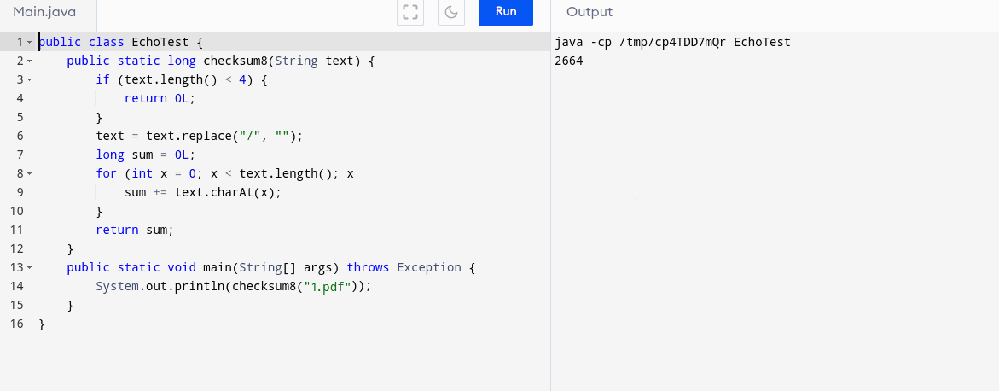

<p align="center">


To check your code calculate, check the site address:

https://www.programiz.com/java-programming/online-compiler/

The important part here is what we need to change is the value of these calculation, so x64 and x86 could have same valu, or different, it's doesn't matter.

```
Note: in case your beacon didn't go online after modification, you need to change the calcucation again, and test it.. it should not be exeeded more than 20kb to go online normally.
```

Now our modify will be only for the value of (92 aka 2665) and (93 aka 2664) of the stagers, don't change anything else.

<h2 align="center"></h2>


<p align="center">


You can remove the ( % 245L ) also, it wont effect out stagers.. just small error will have in compiling.

Next modify will be on the "CommonUtils.JAVA", double click on the file and search for ( checksum8 ) in the functions MSFURI + MSFURI_X64 as below:

MSFURI x32 we need to add our new URI for stager x32

<h2 align="center"></h2>

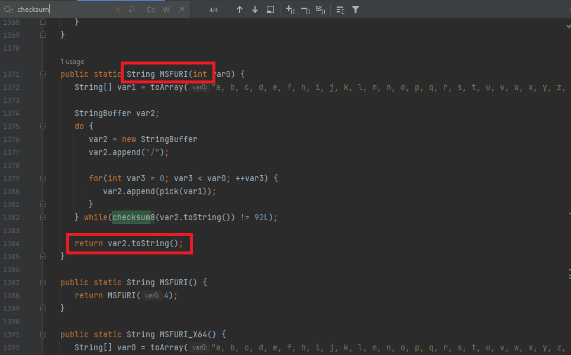

<p align="center">


MSFURI_X64 we need to add our new URI for stager x64.

<h2 align="center"></h2>

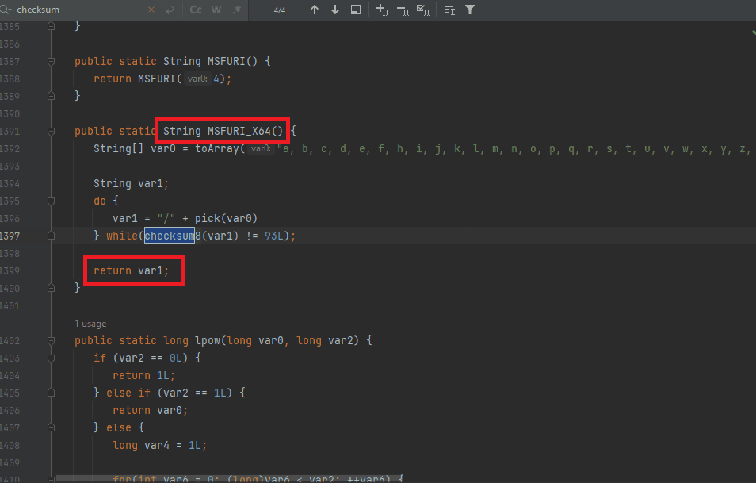

<p align="center">


After chaging, it's should looks like this.

<h2 align="center"></h2>

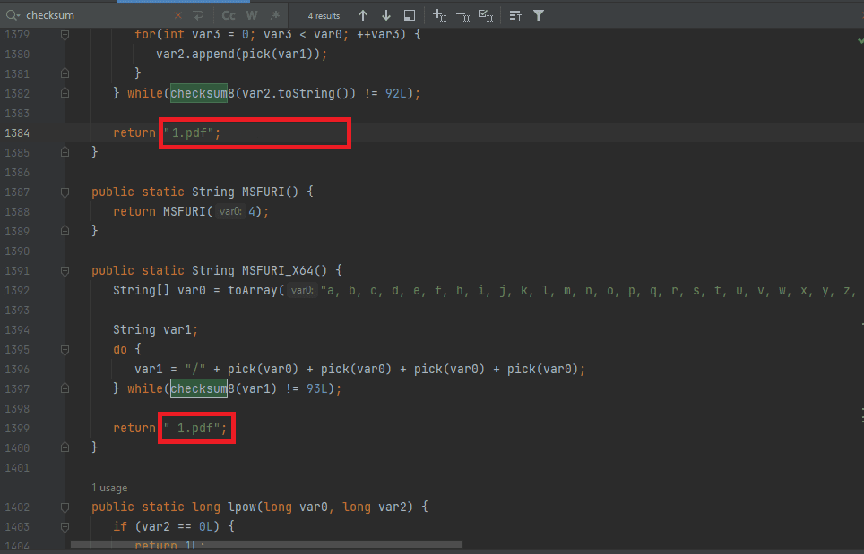

<p align="center">


Now as we see above, we only change 2 files, the cloudstrike functions of webserver and the Commonutils file in the common file...

We need to build the artifacts now project now, we may get some error kz of the changing above, but it's okay, we will fix it simple by remove the errors functions.

As you can see our compile has been done successfully in the help of our Lib/cobaltstrike.JAR ヽ(#`Д´)ﾉ

### Obfuscate Beacons

We will go to second and the most important part in obfuscating our beacon DLL!

We will put our "BeaconPayload.java" inside our "SRC" and make sure the structure is correct as below:

Create folder inside "SRC" and name it "beacon", and paste the "BeaconPayload.JAVA" inside it, it should look like this.

```
src/beacon/BeaconPayload.java
```

Now, open BeaconPayload.java in IDEA, and look at below picture where hex "2E" ( 0x2E ) in decimal encoding.

<h2 align="center"></h2>

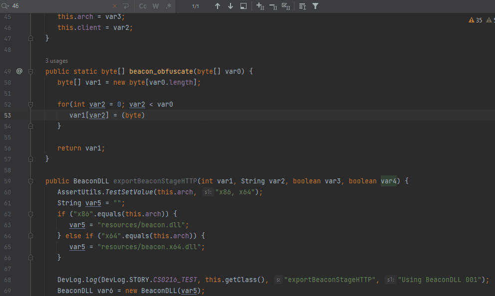

<p align="center">


We need now to change this decimal encode to anything else, for this demo, i have change it to "77" ( 0x4D ) in hex.

Use this site to convert your decimal to hex.

So far, what we did now is obfuscation the source code of loading the DLL in CS, now we need to modify the DLL with "CrackSleeve + IDA".

### CrackSleeve

Hide your Cobalt Strike like a PRO!I want mention here that to be able to modify the DLL you need the key, since the modified cobaltstrike 4.9 i will release with my tool HCS, we will work on Now to modify our beacon DDL's via CrackSleeve.

put the CrackSleeve.java and cobaltstrike.jar in same folder, and edit the file CrackSleeve.java with IDEA.

### IDEA dll Obfuscate

Open IDA and start with any of DLL you want to modify ( i choise the beacon.dll ).

<h2 align="center"></h2>

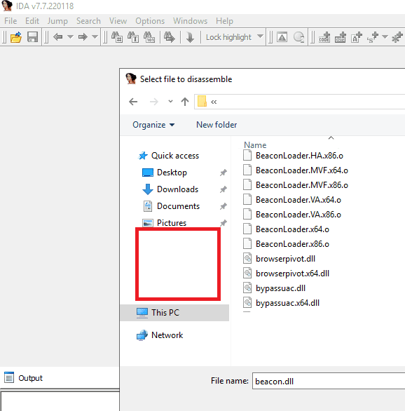

<p align="center">


Search ( ALT+T ) for ( 2E ---> find all occurrences ).

<h2 align="center"></h2>

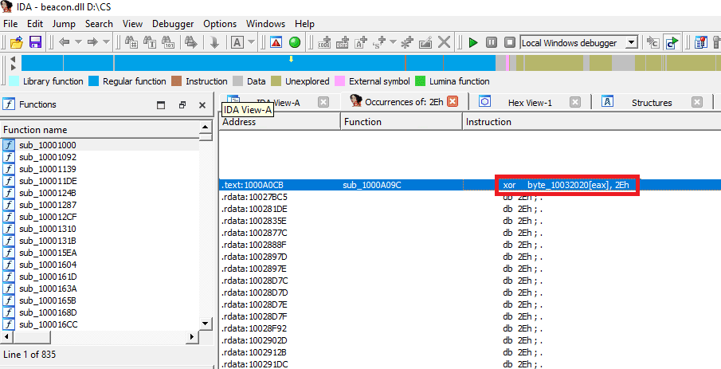

<p align="center">


find "XOR" and click on it, then go to "Edit --> Patch program --> Change byte".

<h2 align="center"></h2>

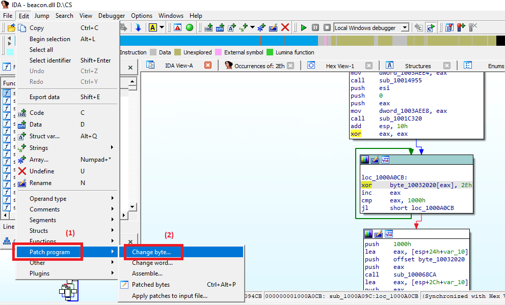

<p align="center">


Change from 2E to any you like, for me i choice 9F

<h2 align="center"></h2>

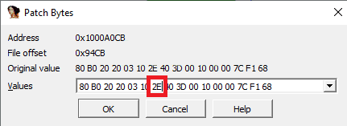

<p align="center">


<h2 align="center"></h2>

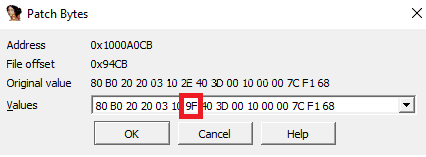

<p align="center">


after editing confirm

<h2 align="center"></h2>

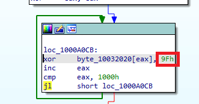

<p align="center">


Then apply the patch.

DON'T SAVE the back! skip it.

Now we need to encrypt our modified DLL through CrackSleeve, run this command and copy the sleeve inside IDEA project.

```
java -classpath cobaltstrike.jar;./ CrackSleeve encode 5e98194a01c6b48fa582a6a9fcbb92d6
```

<h2 align="center"></h2>

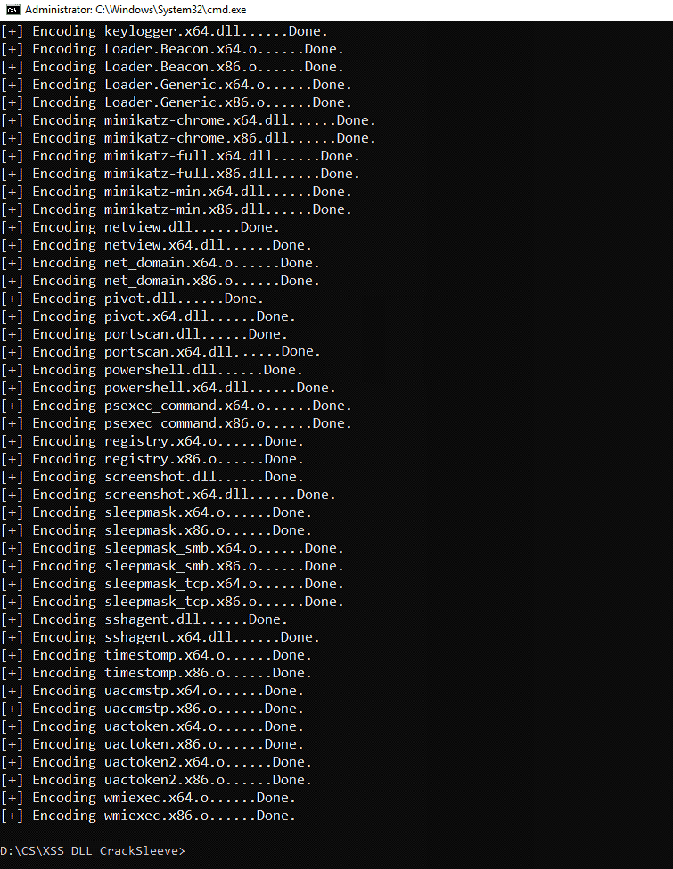

<p align="center">


after confirm the same procedure for the rest of DLL in the sleeve folder, open your IDEA and follow the picture ( copy your sleeve inside IDEA project ).

```
~/ Clone *.Kaspersky.com SSL & Avoid BlueTeam
```

In this part, we will seperate the SSL Hijack with 2 parts:
Clone SSL for your target.
Integrate stolen SSL with C2 script.

- Clone SSL
  Some companies, they add security in TLS to didn't download it, ex: kaspersky.com

If we try to download it, we will get this error:

To bypass this, worldwide company such kaspersky, they spilt subdomains to some partners who don't follow the security policy the headquarter do, so simple subdomain scanning, we grab one of the trusted subdomain of kaspersky, which is: me-en.kaspersky.com, try to clone the SSL and see:


<h2 align="center"></h2>

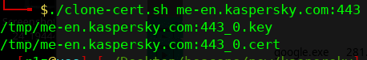

<p align="center">


Sounds perfect now, our Kaspersky.com SSL is ready to use.

But now you need to check the real SSL information, and write it down for our use in the C2 configuration file.

<h2 align="center"></h2>

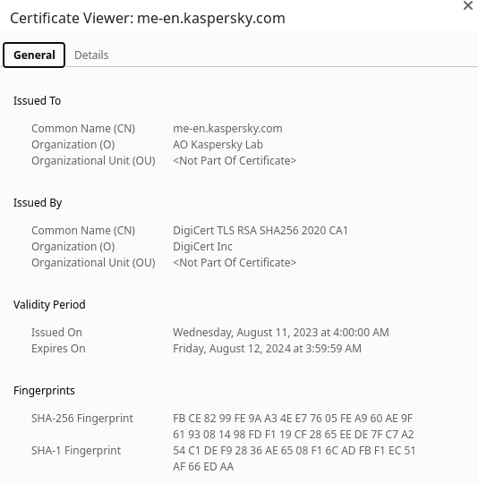


Click in details to get more information.

<h2 align="center"></h2>

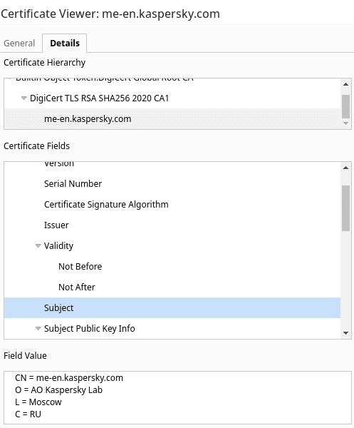


Second my recommended once you know your customer AV to clone the same company SSL and register "FAKE" domain which you will use when we generate our beacon, so to catch our beacon and know that our kaspersky.com domain is "FAKE" will be harder for blue team to analyze it.

also good trick to add subdomain for kaspersky such as, dl.kasperskyetcdomain.com or kav.kasperskyetcdomain.com, and so on..

```
- C2 Setup / RedGuard.
```

The setup for the C2, it's quit easy.. but the most important here for our advanced OPSEC is to use the kaspersky.com domain or any other domain you need, before running your teamserver, setup redguard with the command:

```
git clone https://github.com/wikiZ/RedGuard.git
cd RedGuard
go build -ldflags "-s -w"
chmod +x ./RedGuard&&./RedGuard
```

Once the setup is done, you will see something like this.

This is the default setting, you need to change your setting now in and reload the C2.

```
/root/.RedGuard_CobaltStrike.ini
```

<h2 align="center"></h2>


<p align="center">


Now let's create and configure our listener ( https + http ) with C2, and make sure to have your own "FAKE" domain, as per your client AV, EDR.

http listener ( Port 80 ---> 8080 ).
https listener ( port 443 --> 4433 ).

<h2 align="center"></h2>

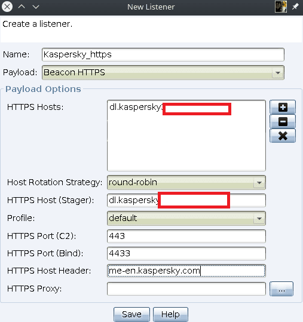

<p align="center">


Once you done, you can check the C2 status.

<h2 align="center"></h2>

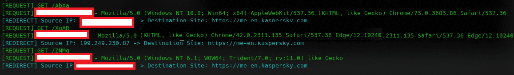

<p align="center">


### Bypass Kaspersky AV / EDR 12.27.2023

Well, most AV / EDR companies the important part for them to disable powershell ! the power of any shell in windows... and today i will share a public "Bypass powershell" script which will work with you in 4-5 steps.

We all hear about Invoke-Image which hide the malicious code (powershell.ps1) inside image (1.jpg), but now we will work on duplicated the encryption of the image.. i will not explain more about, the most important to import the Invoke-PSImage script in your windows lab.

1) open powershell and import Invoke-PSImage.ps1 into your powershell ( make sure AV and Windows Defender is turn off while importing the shellcode ):

```
Import-Module .\Invoke-PSImage.ps1
```

2) generate your malicious image

```
Invoke-PSImage -Script .\payload.ps1 -Out .\1.png -Image .\x.jpg -Web
```

<h2 align="center"></h2>

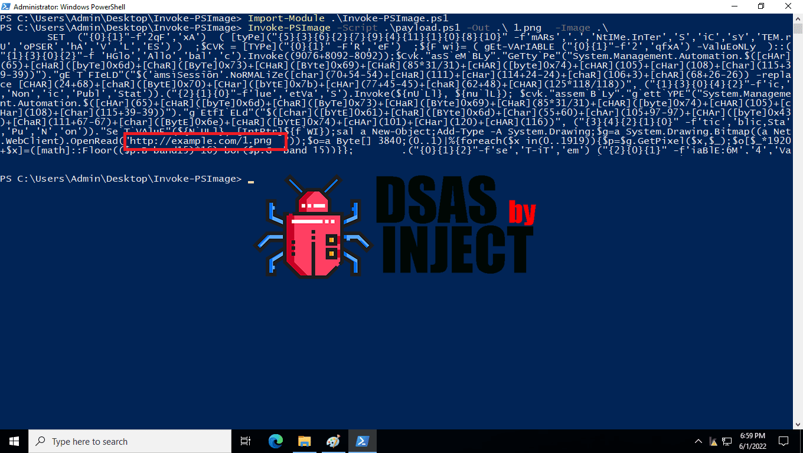

<p align="center">


3) Now and the important part is to get upload your image in your teamserver, and update/insert the uploaded link in your encrypted powershell to run it on the client box.

<h2 align="center"></h2>

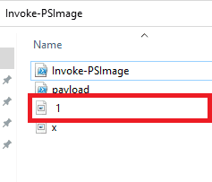

<p align="center">


The PNG looks like real picture, you can upload it anywhere in trusted site or even in client site, or your teamserver.

<h2 align="center"></h2>

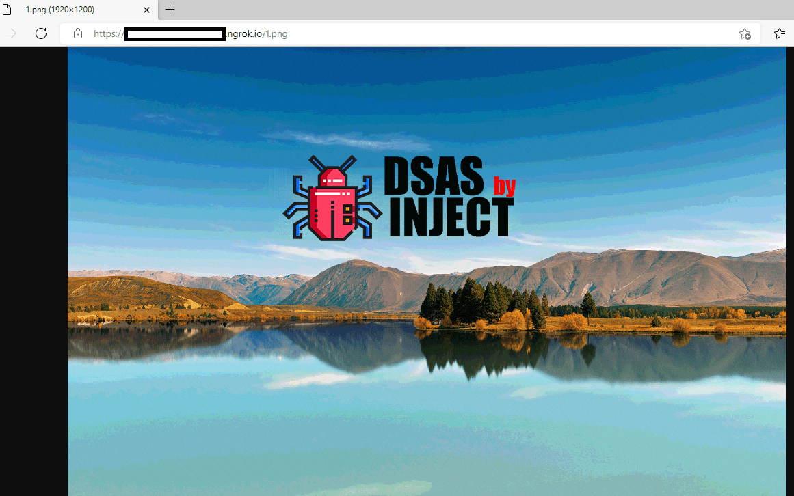

<p align="center">


Setup your cobaltstrike listener.

<h2 align="center"></h2>

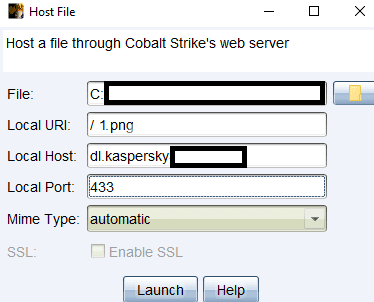

<p align="center">


update the link of the image.

<h2 align="center"></h2>

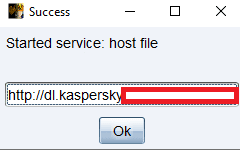

<p align="center">


Copy and paste the updates encoded powershell script and run it in the client powershell.

<h2 align="center"></h2>

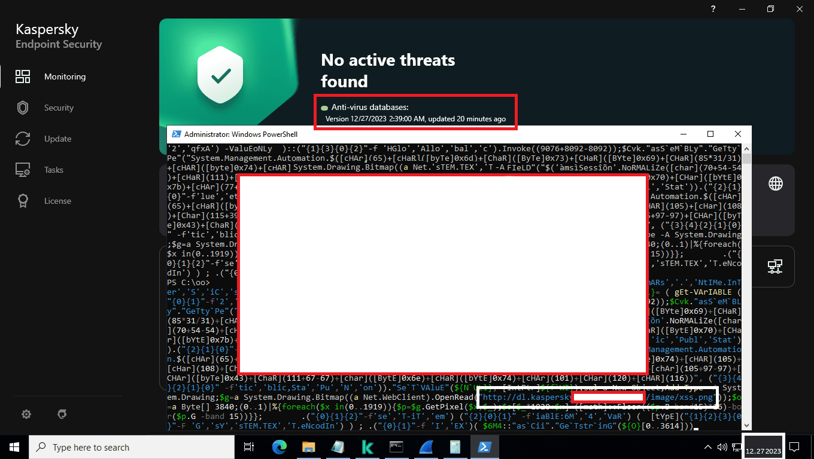

<p align="center">


Additional layer of make our beacon harder to find, our communication with the client will be encrypted through SSL communication under "FAKE" domain of kaspersky we choice;)

<h2 align="center"></h2>

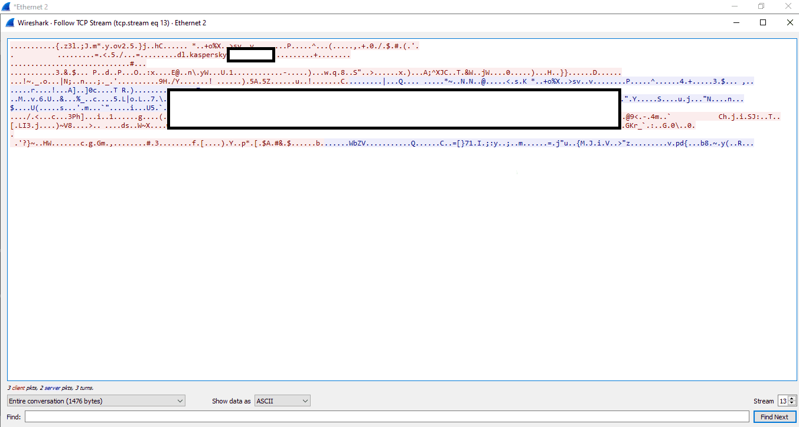

<p align="center">


There is many way, and many tools as a OPSEC you can use, but here i will share some top tools i personaly recommended to use, and we will go trough it step by step until we achieve our goal in bypassing the latest update on Kaspersky End Point Security & Network moniter with our CobaltStrike 4.9

Now your obfuscate steps in your DLL and IDEA project, beacon is not going to leak any information and will remind keep hidden from all "NCCGroup" research's and other bullshit)) up coming will be more strong in OPSEC hidding

Test your modified beacon.dll with any of beacon scanners, ex:
https://github.com/CCob/BeaconEye
https://github.com/Apr4h/CobaltStrikeScan

I want share the most OpSec configuration in your (Malleable C2) to make sure the following options are configured that limit the use of RWXflagged memory (suspicious and easy to detect) and clean up shellcode after beacon startup:

- set startrwx "false";
- set userwx "false";
- set cleanup "true";
- set stomppe "true";
- set obfuscate "true";
- set sleep_mask "true";
- set smartinject "true";

Most of the EDR, AV are working in same checksum, hash check, API check, etc... while working in this article, step by step.. and tunning your profile which is the most important part to hide your activity inside any EDR system, they all work in same gathering way expect few who i will cover how to bypass it in future.

** additional hidden OPSEC on JARM signature, aja JA3's obfuscator, VPN integtration with redirectors, custom cobaltstrike 4.9 Edition and more OPSEC tips and tricks will be added every month on HCS All-In-One script !

Our soup recipe: ヽ (# `Д ●) ﾉ
Nmap scanner. (blocked) ✔️
BeaconEye scanner (blocked) ✔️
Cobalt parser. (blocked) ✔️
Hidden URI aka checksum8. (hidden) ✔️
Hide your Teamserver under CloudFlared Tunnel ✔️
Steal *.Kaspersky.com SSL. (bypassed) ✔️
Bypass Kaspersky End Point Security. (bypassed) ✔️
Install TOR over Teamserver (HCS tool).
Install OpenVPN with redirector (HCS tool).
Install DNSCrypt (DoH) via CloudFlare. (HCS tool).
Install Domains Randomizor (HCS tool).
Install JARM randomizor aka JA3's obfuscator (HCS tool).
install automated script for custom cobaltstrike 4.9 + 4.9.1 (HCS tool).

### THE NOTE

This article is for informational purposes only. We do not encourage you to commit any hacking. Everything you do is your responsibility.

TOX : 340EF1DCEEC5B395B9B45963F945C00238ADDEAC87C117F64F46206911474C61981D96420B72 Telegram : @DevSecAS
